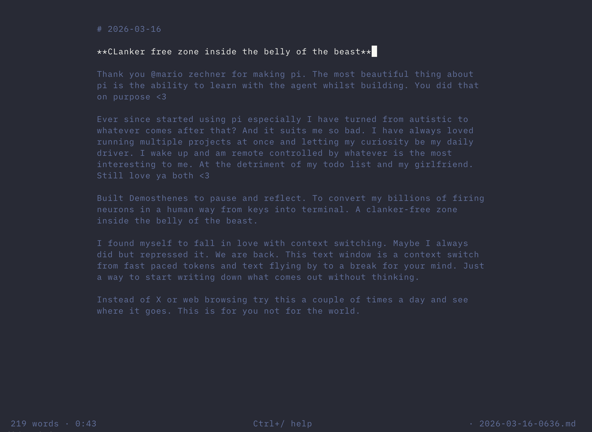

# demosthenes

> *Thank you @mariozechner for making pi. The most beautiful thing about pi is the ability to learn with the agent whilst building. You did that on purpose <3*
>
> *Ever since started using pi especially I have turned from autistic to whatever comes after that? And it suits me so bad. I have always loved running multiple projects at once and letting my curiosity be my daily driver. I wake up and am remote controlled by whatever is the most interesting to me. At the detriment of my todo list and my girlfriend. Still love ya both <3*
>
> *Built Demosthenes to pause and reflect. To convert my billions of firing neurons in a human way from keys into terminal. A clanker-free zone inside the belly of the beast.*
>
> *I found myself to fall in love with context switching. Maybe I always did but repressed it. We are back. This text window is a context switch from fast paced tokens and text flying by to a break for your mind. Just a way to start writing down what comes out without thinking.*
>
> *Instead of X or web browsing try this a couple of times a day and see where it goes. Not for the world but yourself.*

A distraction-free writing mode for [pi](https://github.com/mariozechner/pi). Inspired by iA Writer and the Wiggin children from Ender's Game — who changed the world using nothing but their words. No AI in the editor. No syntax highlighting. No markdown preview. Just you and your thoughts, from keys into terminal.



## Install

Requires [pi](https://github.com/mariozechner/pi).

```bash
pi install git:git@github.com:migsterrrrr/demosthenes
```

Set your journal folder:

```bash
# add to ~/.zshrc or ~/.bashrc
export WRITER_DIR="$HOME/journal"
```

Defaults to `~/journal` if not set.

## Use

```
/write              open file picker
/write new          fresh timestamped entry
/write 2026-03-16   open existing file
/write some-name    open or create by name
```

## Keys

`Ctrl+/` for help inside the editor. The short version:

- `Esc` save and close
- `Ctrl+S` save
- `Ctrl+G` toggle focus mode
- `Ctrl+Z` undo

Full readline keybindings (Ctrl+A/E, Ctrl+K/U, Ctrl+W, Alt+B/F, etc.) — it's a terminal, it should feel like one.

## What you get

- Centered 72-character column
- Focus mode — current paragraph bright, everything else dimmed
- Typewriter scroll — cursor stays centered on screen
- Live timer — how long you've been writing
- Word count in the footer
- Bold headings
- File picker with fuzzy search

## Optional: terminal polish

Works in any terminal. But if you want the full iA Writer feel in Ghostty:

```
# ~/.config/ghostty/config
font-family = iA Writer Mono S
font-size = 16
adjust-cell-height = 2
```

Fonts are free: [github.com/iaolo/iA-Fonts](https://github.com/iaolo/iA-Fonts)

## 404 lines

No dependencies. No config files. One TypeScript file.
